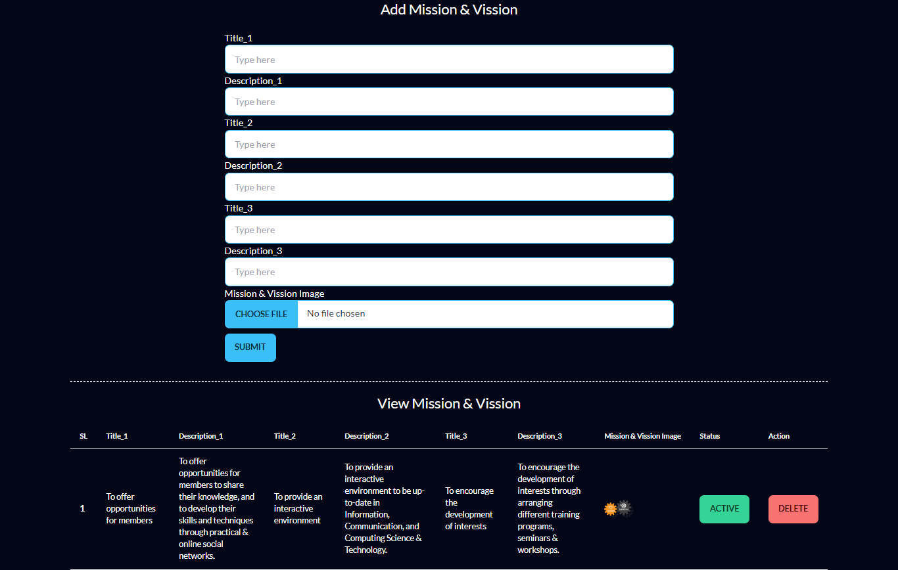

# Green University Computer Club Website
Green University Computer Club (GUCC) is a flagship Club of Dept. of CSE, GUB. Currently, I'm serving the club from the position of Information Secretary & Lead of Information & Publication Unit. This project is still under-developed becasue I've planned for a website which will showcase maximum activities of GUCC and offer the options to get help from this website to users or members of GUCC. Already I've build severel sections which is shown below. 

## 🛠 Technology Used
HTML, Vanilla CSS, Tailwind CSS, Daisy UI, JavaScript, PHP, MySQL, Database

## Features

- Full Dynamic Landing Page
- PHP Validated Sign Up & Sign In Form
- PHP Session
- User Dashboard
- Admin Dashboard
- Update & Toggle Banner from Backend
- Update & Toggle Mission and Vission from Backend
- Update Programs Section from Backend
- Update Blogs Section from Backend
- See User List from Admin Dashbaord
- See Admin List from Admin Dashbaord

## Home Page / Landing Page

## User Sign Up

## User Sign In

## User Dashboard

## Admin Sign In

## Admin Dashboard

## Update & Toggle Banner from Backend

## Update & Toggle Mission and Vission from Backend

## Update Programs Section from Backend

## Update Blogs Section from Backend

## See User List from Admin Dashbaord

## Database

